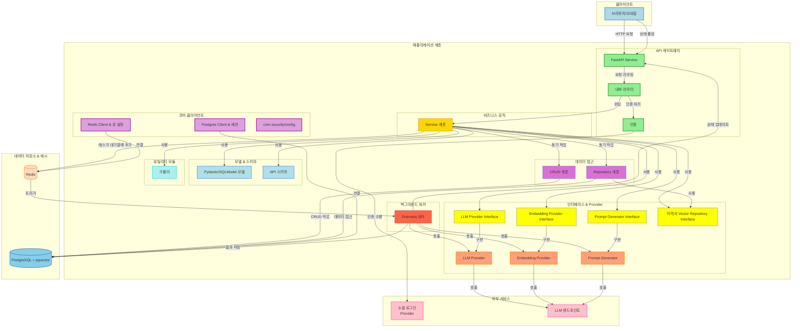

<div align="center">
	


# TechFit
> AI 이력서 평가 및 적성 검사 시스템
 
수강생의 이력서를 AI가 분석하여 역량 기반 정량 평가 및 인사담당자의 성향에 맞는 인재 추천 서비스


[](https://github.com/ocy-likelion/AI_resume_1_backend/blob/main/README.md) [](https://github.com/ocy-likelion/AI_resume_1_backend) [](https://github.com/likelion-rocket-intern/backend/actions/workflows/deploy.yml)
 


</div>


## 설치 및 실행 방법

다음의 환경에서 준비해주세요
- Python 3.10 이상
- uv
- Docker 및 Docker Compose
- PostgreSQL 데이터베이스 (pgvector 확장 활성화 필요)


### 프로젝트 설정

```
git clone https://github.com/likelion-rocket-intern/backend
cd backend
```

### 의존 서비스 실행
```
# Docker 네트워크 생성
docker network create resume_matching
```
```
# Redis 컨테이너 실행
docker run -d --name ll-redis \
  --network=resume_matching \
  -p 6379:6379 \
  --restart unless-stopped \
  redis
```
```
# PostgreSQL (+ PGVvector) 컨테이너 실행
docker run -d   --name ll-pgvector\
  --network=resume_matching \
  -e POSTGRES_USER=myuser \
  -e POSTGRES_PASSWORD=1234 \
  -e POSTGRES_DB=ll_rocket \
  -p 5432:5432 \
  --restart unless-stopped \
  pgvector/pgvector:pg17
```
```
# PGVector 확장 활성화
sleep 5
docker exec -it ll-pgvector psql -U myuser -d ll_rocket -c "CREATE EXTENSION IF NOT EXISTS vector;"
```

### Python 가상환경 및 의존성 설치
```
# 가상환경 활성화
uv venv
source .venv/bin/activate
```
```
# 의존성 설치
uv sync

# DB 마이그레이션
alembic upgrade head
```

### 사전 세팅 실행
다음 스크립트를 실행하여 DB 테이블 및 초기 데이터를 주입합니다.
```
./scripts/prestart.sh
```

### 어플리케이션 실행
```
# 터미널 1: FastAPI 서버 실행


# FastAPI 서버 실행
uvicorn app.main:app --host 0.0.0.0 --port 8000 --reload
```

```
# 터미널 2: Dramatiq 워커 실행 (백그라운드 작업 처리)

# Dramatiq 워커 실행
./scripts/worker-start.sh

```

## 아키텍처


## API

<div align="center">
	
자세한 사항은 FastAPI Docs를 참고해주세요.

( FastAPI 서버 구동 후 [`http://localhost:8000/docs/`](http://localhost:8000/docs/) )

| **기능** | **메서드** | **엔드포인트** | **설명** |
| --- | --- | --- | --- |
| **시스템** | GET | **`/metrics`** | 시스템 메트릭 조회 |
|  | GET | **`/health`** | 서버 상태 확인 |
| **인증** | GET | **`/api/v1/auth/kakao/login`** | 카카오 로그인 페이지로 리디렉션 |
|  | GET | **`/api/v1/auth/kakao/callback`** | 카카오 인증 콜백 처리 |
|  | GET | **`/api/v1/auth/logout`** | 로그아웃 |
|  | GET | **`/api/v1/auth/me`** | 현재 로그인된 사용자 정보 조회 |
| **이력서** | POST | **`/api/v1/resume/analysis`** | 이력서 업로드 및 분석 요청 |
|  | GET | **`/api/v1/resume/task/{task_id}`** | 이력서 분석 작업 상태 확인 |
|  | GET | **`/api/v1/resume/{resume_id}`** | 특정 이력서 정보 조회 |
|  | DELETE | **`/api/v1/resume/{resume_id}`** | 특정 이력서 삭제 |
|  | GET | **`/api/v1/resume/`** | 전체 이력서 목록 조회 |
| **진로탐색** | GET | **`/api/v1/jinro/user`** | 사용자의 진로 테스트 결과 조회 |
|  | GET | **`/api/v1/jinro/user/latest`** | 사용자의 최신 진로 테스트 결과 |
|  | GET | **`/api/v1/jinro/test-questions-v1`** | 진로 테스트 질문지 조회 (v1) |
|  | POST | **`/api/v1/jinro/test-report-v1`** | 진로 테스트 결과 제출 (v1) |
|  | GET | **`/api/v1/jinro/{id}`** | 특정 진로 테스트 결과 ID로 조회 |
| **JD 분석** | POST | **`/api/v1/jd/analyze`** | 이력서 기반 JD(채용공고) 분석 요청 |
|  | GET | **`/api/v1/jd/task/{task_id}`** | JD 분석 작업 상태 확인 |
| **크롤러** | GET | **`/api/v1/crawler/`** | 크롤러 정보 조회 (내부용 추정) |

</div>

## 기술 스택

<div align="center">

| 영역         | 기술 스택                                                                 |
|--------------|--------------------------------------------------------------------------|
| **백엔드 (Backend)** | Python (3.10+), FastAPI, Pydantic, SQLModel |
| **AI / LLM & 자연어 처리 (NLP)** | LangChain, Sentence-Transformers, <br/> Gensim (Word2Vec), HuggingFace,<br/> PyTorch, Numpy, Pandas |
| **데이터베이스** | PostgreSQL, pgvector, Alembic |
| **인프라 및 배포** | Docker , Docker Compose |
| **비동기 처리** | Redis, Dramatiq, ThreadPool |
| **개발 환경 및 도구** | Git, Github, uv, MyPy, Pytest, Ruff|

</div>

